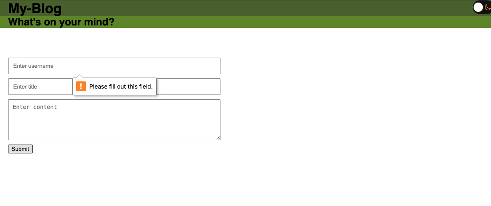

# my-blog
## Discription
This assignment required a blog landing page where you can enter some user info such as username, blog title and content, and on submit you will be taken to page that displays the blog and past blogs saved in the local storage.
It requires input in the fields in order to submit, you can see the prompt on the landing page below.

There is light and dark mode on both pages, and the past blogs are also displayed:

At the footer, it shows my name and a link to a portfolio site.

## Acknowledgment
I had help from researching from google and the BCS Learning Assistants!
